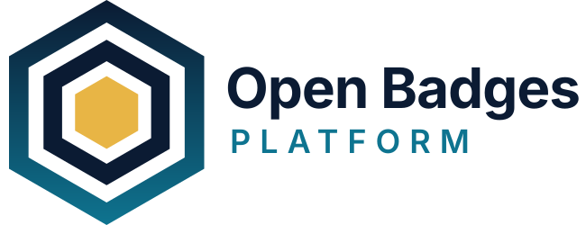

---

Sovereign, Immutable, and Standard-Compliant Recognition.

Esta plataforma es una implementación del estándar Open Badges 2.0 (1EdTech) diseñada para emitir y validar insignias digitales de forma soberana.

## 🎨 Identidad de Marca

La identidad visual **"Sello Soberano"** (hexágono, paleta navy/teal/dorado) está documentada en **[BRANDING.md](BRANDING.md)** e implementada en el frontend (tema claro/oscuro, tipografía Space Grotesk/Inter/JetBrains Mono, favicon y logos en `src/main/webui/public/brand/`).

## 🚀 Stack Tecnológico

El proyecto está diseñado como un monolito moderno optimizado para la nube, asegurando bajo consumo de recursos y alto rendimiento.

* **Backend:** Java 21 + Quarkus.
* **Frontend:** Nuxt (Vue.js) servido mediante Quarkus Quinoa.
* **Base de Datos:** SQLite3 (Embebida).
* **Estilos:** Tailwind CSS + daisyUI.

## 🤝 Cómo Contribuir

¡Las contribuciones son bienvenidas!

1. Lee nuestro **[Código de Conducta](CODE_OF_CONDUCT.md)** para asegurar un ambiente saludable.
2. Revisa la **[Guía de Contribución](CONTRIBUTING.md)** para entender el flujo de trabajo y los estándares.

## 📜 Licencia

Este proyecto es **Software Libre** bajo la licencia **GNU Affero General Public License v3.0 (AGPL-3.0)**.

> Tienes la libertad de usar, estudiar, compartir y modificar el software. Si modificas este software y lo ofreces como un servicio a través de una red (SaaS), **estás obligado a compartir el código fuente completo** de tu versión modificada bajo la misma licencia.

Consulta el archivo [LICENSE](LICENSE) para más detalles.

---

Hecho con ❤️ por el **GDG Guadalajara**.